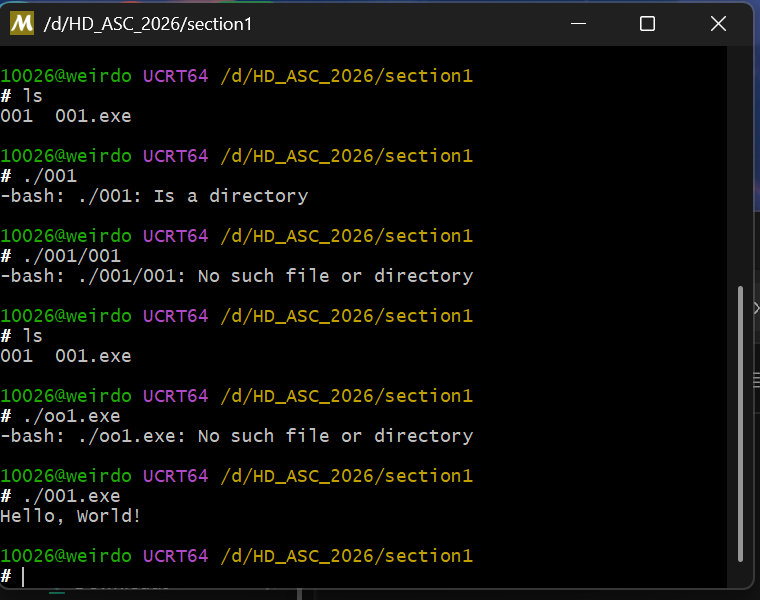

# 说明

基于杭电ASC车队选拔的题目

https://oj.hduasta.cn/training/688c2a2f62394f546ff5c75b

# 如何搭建环境

## 1.基于vscode来写c代码

## 2.写完代码之后如何编译

**第 1 步** 在 **PowerShell** 里装 MSYS2(会联网下载):

```powershell
winget install --id MSYS2.MSYS2 -e --accept-package-agreements --accept-source-agreements
```

**第 2 步** 开始菜单搜索打开 **"MSYS2 UCRT64"**(注意不是默认那个 MSYS2 shell),在里面执行:（如果安装过程中出现报错可以尝试重试这一步 并右键后点击以管理员身份运行）

```bash
pacman -S --noconfirm mingw-w64-ucrt-x86_64-gcc
```

它会自动把 gcc/g++/链接器一起装到 `C:\msys64\ucrt64\bin`。

> 如果下载很慢（可以换清华源）：
>
> 1.**查真实文件名**：`ls /etc/pacman.d/`，看到实际是 **`mirrorlist.mingw`** 和 **`mirrorlist.msys`** 两个文件（mingw/ucrt64 仓库合在一个 `mirrorlist.mingw` 里）
>
> 2.换文件之后重新下载 如果有404报错可以先问ai这些报错的文件是不是必要的 如果不是就进入下一步

可选：这一步执行完可以直接在这个环境中直接编译和运行代码（见第四步）

1.（如果有报错 可能也是权限问题 可以直接管理员身份运行）

2.如果想了解编译的命令 可以在b站搜索gcc编译相关内容


**第 3 步** 加进 PATH(让任何终端都能叫出 `gcc`):

- Win 键搜 **"编辑系统环境变量"** → 环境变量 → 用户变量里选中 **Path** → 编辑 → 新建
- 粘贴 `C:\msys64\ucrt64\bin`
- 一路确定,**重开终端**


**第 4 步** 验证并编译:

```bash
gcc --version
cd /d/HD_ASC_2026（修改成你自己c文件所在的目录）
gcc 001.c -o 001 && ./001 （001是我的文件名）
```


